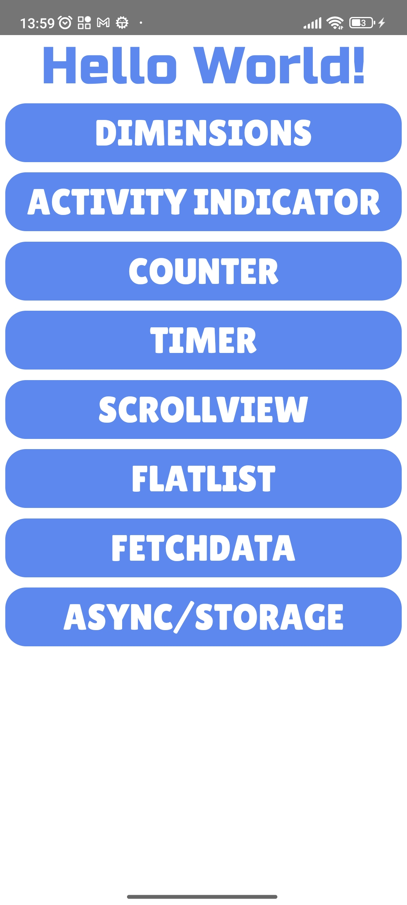
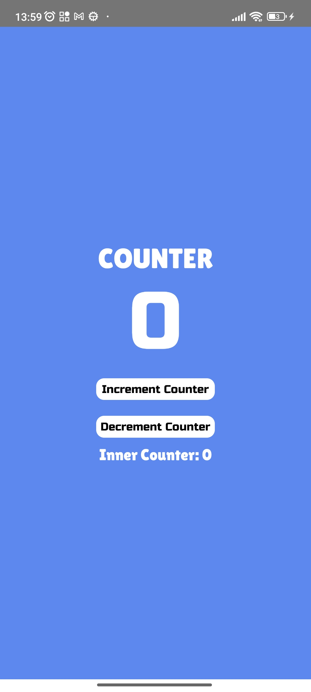
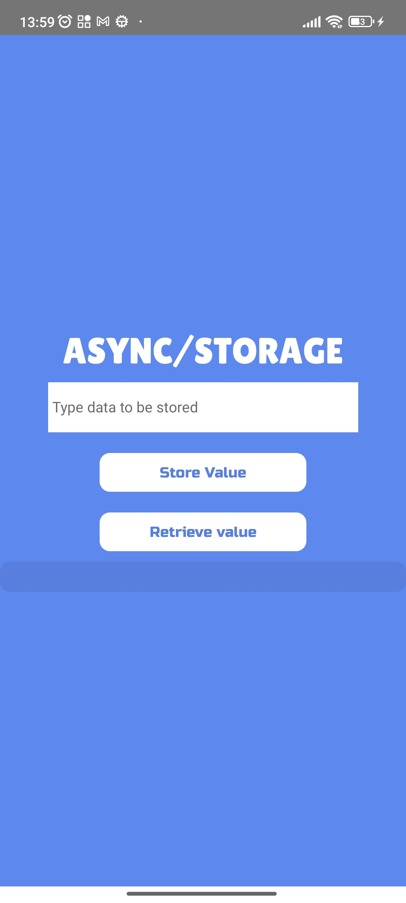

# React Native Assignments 📝
This project includes implementation of basic react native concepts like dimensions, activity indicators, async/storage,usage of hooks.

# Screenshots 📱

# Author 👨‍💻
Apar Gautam(https://github.com/aparg)